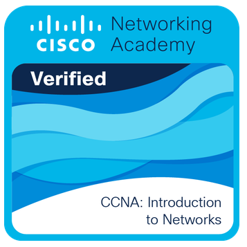
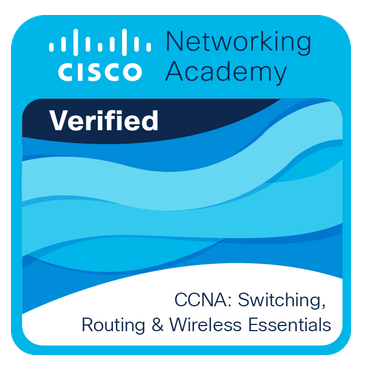

<h1 align="center">✨ Hi, I’m Thea 👋</h1>

  

---

### 🌸 About Me
- 🎓 4th-year **IT student** at MSU-IIT  
- 💻 Learning more about **Web Dev, Networking, and System Design**  
- 📖 Currently working on a thesis about **Underground Cabling using Graph Theory**  
- ✨ Shy but open to **learning** new things and **improving** step by step  

---
### 🚀 Projects
- 📊 **Underground Cabling using Graph Theory (Thesis)**  
- 🌐 **Networking Labs** (Packet Tracer configs)

### 🛠️ Languages & Tools

  
  
  
  
  

----

### 🏅 Achievements & Certifications
- 🎓 Cisco Badge & Certificate: *CCNAv7: Switching, Routing, and Wireless Essentials*
                  & *CCNA: Introduction to Networks*

  
  

### 📫 Connect With Me

  
  
  

---

  💡 *“Still learning, step by step.”*

<!--
**altheaalia/altheaalia** is a ✨ _special_ ✨ repository because its `README.md` (this file) appears on your GitHub profile.

Here are some ideas to get you started:

- 🔭 I’m currently working on ...
- 🌱 I’m currently learning ...
- 👯 I’m looking to collaborate on ...
- 🤔 I’m looking for help with ...
- 💬 Ask me about ...
- 📫 How to reach me: ...
- 😄 Pronouns: ...
- ⚡ Fun fact: ...
-->
